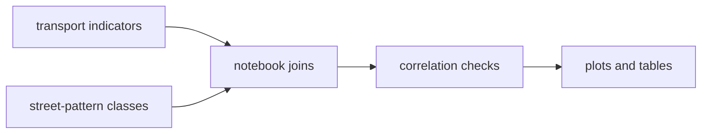
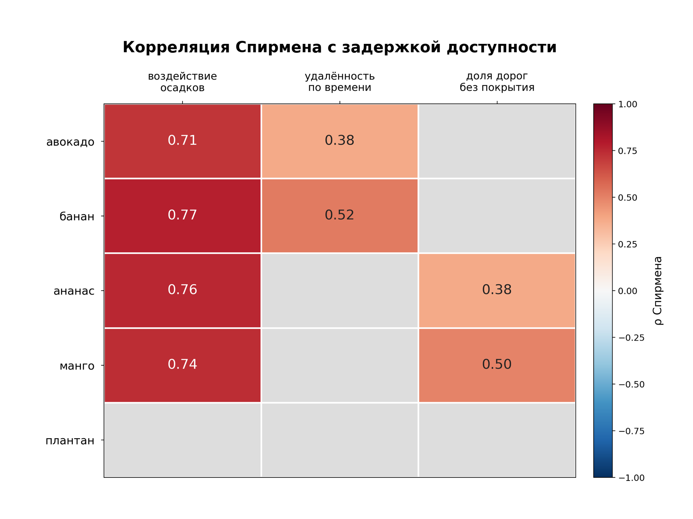

# corr_transport_street_pattern

Notebook experiments for comparing transport indicators with street-pattern structure across time and cities.

## System Map



## Main Result



## Run

Entrypoint: `cleaned_ver.ipynb`

Human:

```bash
jupyter notebook cleaned_ver.ipynb
```

Agent: preserve notebook outputs that justify a claim; if a correlation changes, inspect the joined rows and city/year coverage before summarizing it.

## Publication

No standalone publication tracked; thesis integration is in the parent repo. The README result image is copied from the dissertation figure set.

## Next Steps / Heuristics

Heuristic: treat correlations as exploratory evidence, not causal claims. Keep mode/year filters visible in the notebook rather than hidden in helper code.
